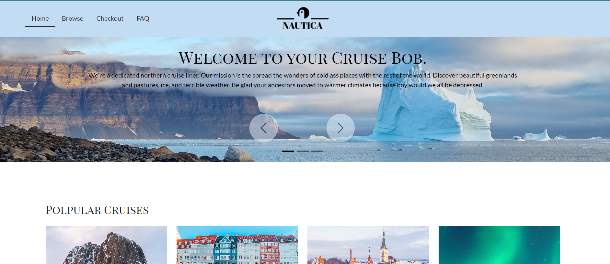
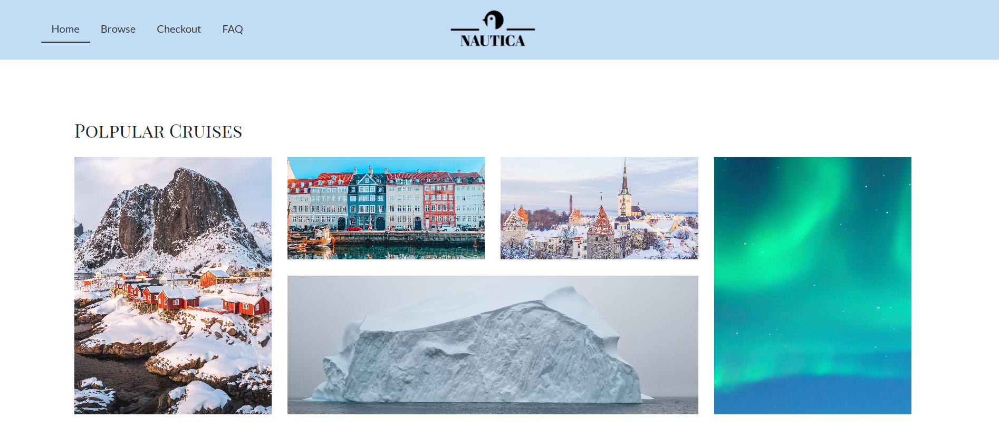
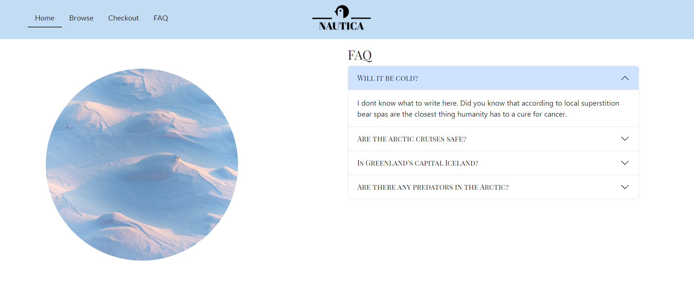
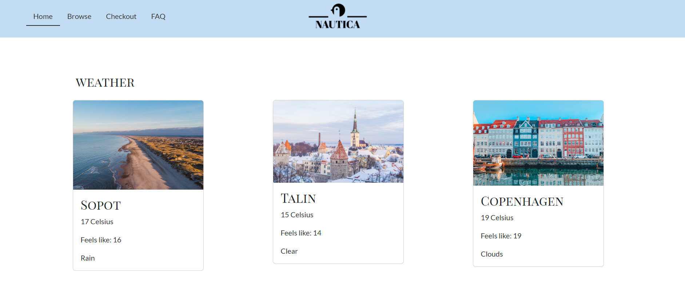
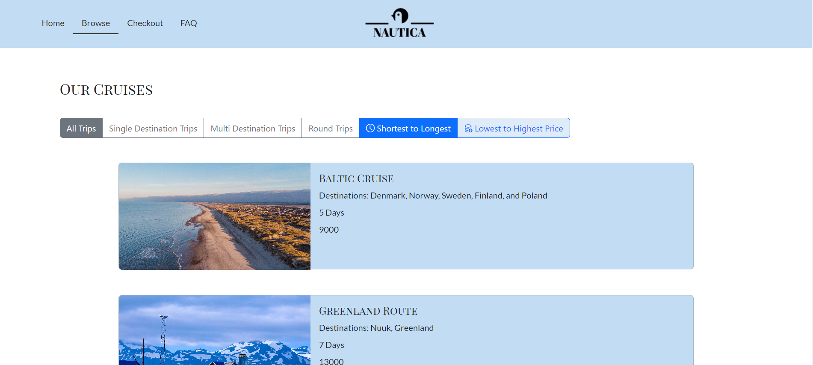
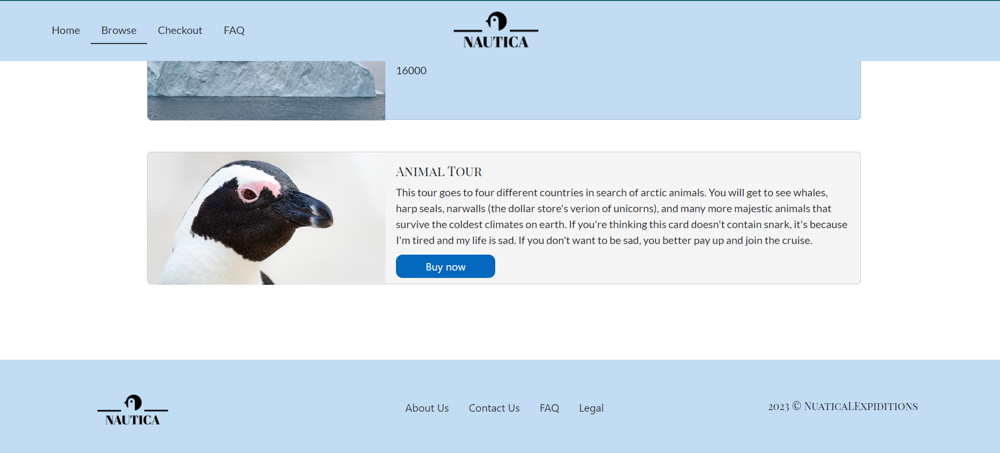
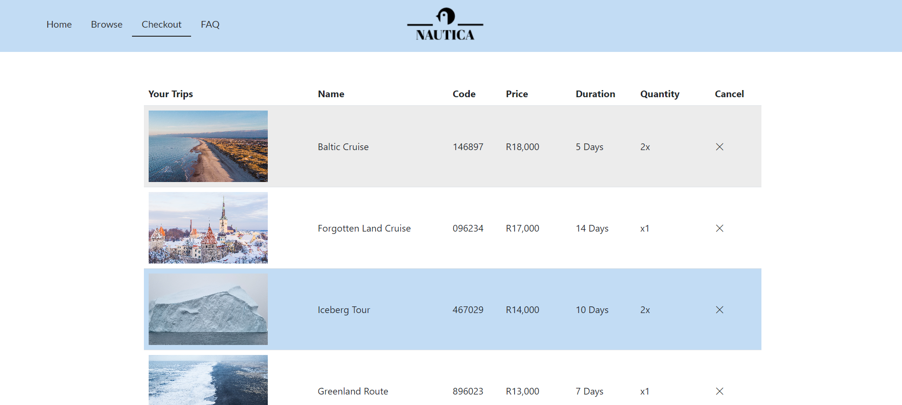
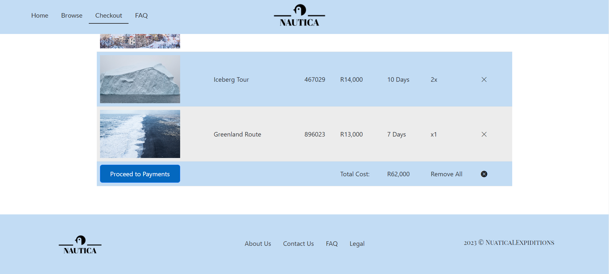

# DV-100-Term-3-Loraynne

# About the Project

### The project is a website for a cruise liner company. The company is called Nautica and it specialises in arctic and baltic cruises. I'm telling you, icebergs are weak compared to our indestructable cruise ships. Geez Bob. Your safety is 100% garanteed.

## **Home Page**
The hero page has a carousel slider, a gallery, an FAQ accordion, and weather cards. 

### Hero Slider:

### Gallery:

### FAQ Accordion:

### Weather API:

## **Browse Page**
The browse page contains trip cards with information on them. When you click the card a buy button and extra information appears. There is also a few filters and sorts the user can use to dfind the trip they're looking for.
### Trip Cards:

### On Click Extra Information:

## **Checkout Page**
The checkout page has a table with your orders listed on it. The table contains information such as the name, quantity, duration, trip code, and duration of the trip. There is also a remove button and remove all button. There's a total price and a proceed to payment button that leads to a "Thank you" modal 
### Order Table:

### Proceed Column:

# Getting Started

### You would need some sort of electronic device and wifi or data. If you have that, you need to get GitHub. You can also get Visual Studio Code if you want to use the same software I am.

# Built With

- HTML
- CSS
- JavaScript
- Bootstrap
- Open Weatheer API
- JQuery
- Insomnia
- Pexel
- Unsplash
# Contributing

### If you require any assistance, please do not hesitate to contact me on 231056@virtualwindow.co.za for more information.

# Authors

- Loraynne van Tonder (Me)
- Celeste van Tonder (My Sister) 
  Helping me fix broken code & getting my shitty button to work.

# Licence

### MIT License

# Acknowledgement

- Tarryn-Leigh-Tong (My Friend) 
  Thank you for the moral support and helping me with that guy, Dave!
- Karlo Kyuper (Teacher's Asisstant)
- Paul Roots (Lecturer)
- Dr. Google
- Naruto Guy on the internet

# Protoype Video
My Loom account expired and now I have to pay to download stuff, so this is perfect. Just click the link!
https://www.loom.com/share/5847d39477644ac6a5eff73f70e7b0ca?t=285&sid=fbdd44d2-b073-4ea2-a266-1ab9dded97a8

# Plagiarism Document
https://acrobat.adobe.com/link/review?uri=urn:aaid:scds:US:578e7838-4660-3288-8dff-da6df4e4d1bb

# Some References
Hey there! All my images are from Unsplash and Pexels. My logo is from Adobe Logo Maker. (That was a mistake. The logo was an absolute little asshole.) Finally, my icons are from the Bootstrap icons.

Okay cool people! Enjoy marking! Bye ^^